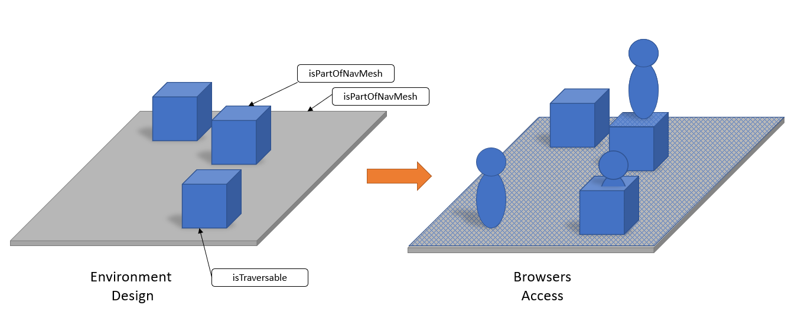

# Navigation Mesh

Navigation is possible on a navigation mesh (NavMesh), this mesh is generated on browsers based on the meshes or submodels that have been marked as _isPartOfNavMesh_ in the environment. A model can also be marked as traversable not to modify the structure of the underlying NavMesh.

## Requests

### Navigation Request

An environment may request for a user to navigate to a point of the environment.

### Teleportation Request

An environment may teleports its user to another point of the environment with a rotation to apply.

### Vehicle Request

 An environment may board a user in a vehicle.
