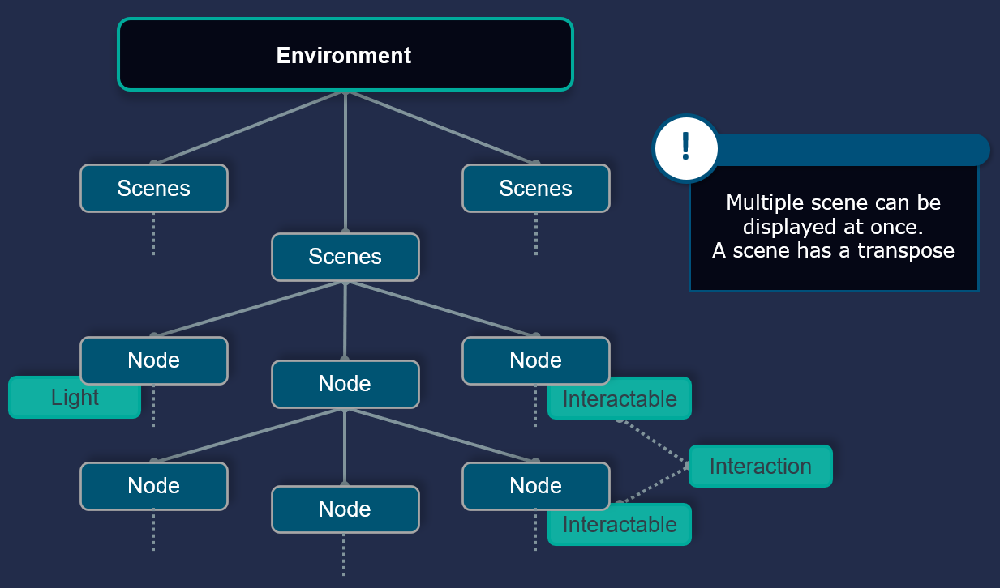

# Environment description

## glTF base

The environment description used in UMI3D relies on the glTF open standard for three-dimmensional scenes and models desscription, from the Khronos Group. The glTF standard represent an environment as a tree of nodes, that may possess differents properties (better known as components). The glTF standard admits extensions to properties, to extend their abilities. A such, each UMI3D component is an extension of a glTF property.

## Environment

An Environment is the root of the scene graph. It also comprise other essential information such as its name.

## Scene

An Environment can possess several scene that could be displayed at one. From and including the scene, each child node has its own transform component (a position and a rotation)

## 3D Assets

UMI3D provides extensions for a lot of usual 3D assets that are node components (Models, Meshes, Lights, Canvas...).

- 3D Rendered
    - Line
    - Mesh
    - Model
    - Submodel
- UI
    - Canvas
    - Rect
    - Text
    - Image
- Other
    - Light

## Material

Materials could be added to the environment to be used by other assets.

Suported Materials are

- PBR materials
- External materials

## Animations

An animation is the description of any playable sequence of a media. Node animation thus moves nodes while video and audio animation based on specific ressources can also be played.

Supported animation are

- Video
- Audio
- 3D movement animation
- Animation through animators

## Shaders

Shaders with custom properties are supported.

## Post-Processing effects

Post-Processing effects are packaged with the environment to tell the browser to execute them if possible.

Currently supported post-processing effects are

- Deferred fog
- Global bloom
- Global vignette
