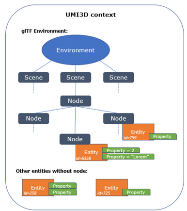
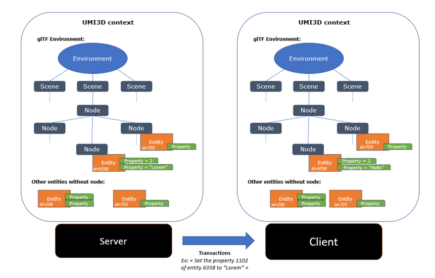

# Environment synchronization

After a enviroment has been loaded on a browser, changes can happen to objects in the remotely hosted enviroment (e.g. a moving ball, or color change on a wall). It is necessary to maintain a coherence between the environment description on the server and the one on the browsers.

## Entities



Any object that belongs to an environment and is concerned by the environment synchronization is a `UMI3DEntity`. This includes all objects on the scene graph but all entities are not necessarily a part of the scene description. A `UMI3DEntity` possesses a unique ID that s attributed by the server on runtime and one or several `EntityProperty`.

## Transactions



A `Transaction` is the wrapper around one ore several `Operations` and is the message sent from the server to the clients to inform the connected browsers of a change. A transaction could be either _reliable_ or not. Reliable transactions are guarranted to be received by clients, at the cost of a longer message and processing, while unreliable transactions do not have this verification step, making them lighter and faster.

## Environment Synchronization

### Operations


An `Operation` is a unit change to a UMI3D `Entity`. It could either be its loading and destroying, or ore often the setting of one of its asynchroneous _properties_. Each type of `EntityProperty` is identified in UMI3D through a unique ID. See the [Networking section](/External/Reference/UMI3D-SDK/Core/Networking) for more information.

Syntax for a new transaction:

```cs
Operation operation = new SetEntityListProperty()
{
    users = new HashSet<UMI3DUser>(UMI3DServer.Instance.Users()),
    entityId = entityId,
    property = propertyId,
    value = aValue
};
Transaction transaction = new Transaction() { reliable = true; };
transaction.Add(operation );
transaction.Dispatch();
```

### Asynchroneous Properties


Asynchroneous properties (`AsyncProperties`) are properties of UMI3D entities that are allowed to be set and to be different from one user to another, resulting in two different values in two different browsers.

Their value is set through a `SetValue()` call on the AsyncProperty wrapper. It returns a `Transaction` ready to be dispatched.
