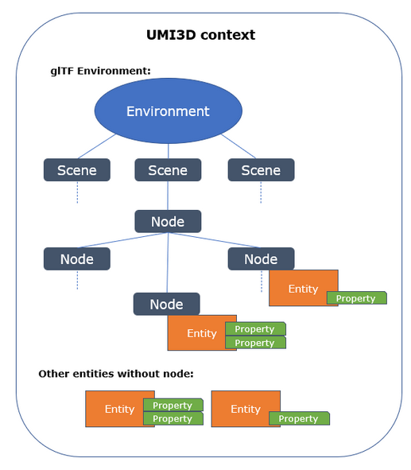

# Environment model

## Scene synchronization

The scene synchronization module is the core of UMI3D. UMI3D Scene Synchronization model is based on two standardized data models enabling the loading and synchronization of a remote 3D environment composed of assets in multiple formats and/or levels of detail. The scene description data model is an extension of glTF 2.0 following its standard format for extensions. The synchronization model is a standardized transactional communication protocol enabling the virtual environment to broadcast its changes to all the connected devices.

Using UMI3D to communicate with XR devices, remote virtual environments, also known as virtual worlds, are providing a web API enabling these devices to download the 3D scene composing the world in its current state. The object returned in the bson format follows glTF 2.0 data structure, if the scene is not directly provided as a .glb or .gltf file. glTF 2.0 is an ISO international standard created by the Khronos group focused on the transmission and loading of 3D assets and scenes. UMI3D scene description is based on extensions of glTF 2.0 using the Extension Mechanism documented on Khronos GitHub.

## glTF base

The environment description used in UMI3D relies on the [glTF open standard](https://registry.khronos.org/glTF/specs/2.0/glTF-2.0.html) for three-dimmensional scenes and models desscription, from the Khronos Group. The glTF standard represent an environment as a tree of nodes, that may possess differents properties (better known as components). The glTF standard admits extensions to properties, to extend their abilities. A such, each UMI3D component is an extension of a glTF property.

