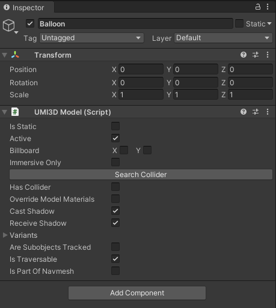

# Add a 3D model

To make your environment rich and interesting, you will surely need some 3D models. Here is a short guide to add one to your environment and place it as you want.

## Store your 3D asset

### 1. Define a place of stage

Find the "/data" folder at the root of your project.

You should create the folder if you do not have it.

### 2. Define the storage access level

Choose whether your file should be publicly available or not by choosing the corresponding folder.

You should create the folders if you do not have them.

### 3. Import your asset

Add your 3D assets to any subfolder of your choice.

## Reference it in the scene

### 1. Add a new gameobject

Open your environment. Under your `UMI3D Scene` node, add an empty object.

### 2. Add a Model component

Add a `UMI3D Model` component to that node.

!!! note

    Make sure the node with `UMI3D Model` component has all its parents up to the node with the `UMI3D Scene` component having `UMI3D Node` components.

### 3. Set up variants

Unwrap the _variants_ parameters and set the size value to 1 to add a variant

### 4. Set up format

Set up the format to the one of the model to link, check the _Is a local file_ checkbox, and browse in your file explorer towards the desired 3D model.

## Modify its position, orientation or size

### 1. Display a local copy

Add an import of the model through Unity to see your model in the editor.

### 2. Apply any transformation

Modify the Transform component on the node that has the `UMI3D Model` component attached. Here, the scale is reduced to (0.25, 0.25, 0,25).

