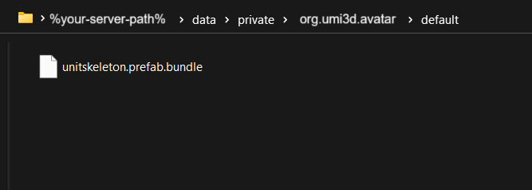

# Set an avatar for a user

To make users able to see themselves and each other, consider adding 3D avatars to your users. The UMI3D skeleton system allows them to be synchronized with user's movement.

## Set up an avatar model

!!! abstract "Requirements"
     To create an avatar bundle, you'll need the Unity package Asset Bundle Browser (_com.unity.assetbundlebrowser_). Make sure to import it in your animation project beforehand.

### 1 - Create or import a hierarchical avatar

First, you need a 3D model that follow some sort of humanoid hierarchy. Best is to follow the UMI3D Standard Hierarchy description or a common format.


### 2 - Export your avatar bundle

Click on the "Select" button right new to the assetbundle adress bar. Then export your bundle through the assetbundle window.


You'll get a bundle file _"%your-avatar-name%.prefab.bundle"_ in the export folder.

And store that bundle in the data folder of your UMI3D server.



## Manage your avatar

### 1 - Create an avatar manager

Create a new script **AvatarManager** with those fields:

```cs
public class AvatarManager : MonoBehaviour
{
    private Dictionary<UMI3DUser, UMI3DModel> handledAvatars = new();

    [Header("Avatar")]
    [SerializeField, Tooltip("Scene where to instantiate avatar.")]
    private UMI3DScene AvatarScene; // this scene could be different from the main one

    [SerializeField, Tooltip("Avatar model to load.")]
    private UMI3DResource AvatarModel;

    // Structure to define a binding offsets
    [System.Serializable]
    public class RigBindingData
    {
        [ConstEnum(typeof(BoneType), typeof(uint))]
        public uint boneType;

        public string rigName;
        public Vector3 positionOffset;
        public Vector3 rotationOffset;
    }

    // List all the required binding to make with their offsets
    [System.Serializable]
    public class RigList
    {
        public List<RigBindingData> binds;
    }

    [Header("Rigging")]
    [SerializeField, Tooltip("If true, the rigs of the avatar are bound to the user's skeleton bones.")]
    private bool shouldBindAvatarRigs;

    [SerializeField, Tooltip("List all the required binding to make with their offsets.")]
    private RigList Rigs;
}
```

And attach the associated component to one of the gameobjects in your environment. Lastly, fill up the fields. Rigs should corresponds to the one in your avatar hierarchy.


### 2 - Send the avatar model

You need to create the avatar model for the user through this method.

```cs
    private Operation SendAvatarModel(UMI3DCollaborationUser user)
    {
        GameObject avatarModelnode = new($"AvatarModel_User-{user.Id()}");

        avatarModelnode.transform.SetParent(AvatarScene.transform);
        avatarModelnode.transform.localPosition = Vector3.zero;
        avatarModelnode.transform.localRotation = Quaternion.identity;

        UMI3DModel avatarModel = avatarModelnode.AddComponent<UMI3DModel>();
        avatarModel.objectModel.SetValue(AvatarModel);
        avatarModel.objectScale.SetValue(user.userSize.GetValue(user).Struct());

        handledAvatars[user] = avatarModel;

        return avatarModel.GetLoadEntity();
    }
```

### 3 - Bind your avatar model to the user's skeleton

To move the avatar with the skeleton's movements, you'll need to bind the avatar rigs to the bones of the skeletons.

First, get the binding service.

```cs
    private IBindingService bindingHelperService;

    private void Start()
    {
        bindingHelperService = BindingManager.Instance;
    }
```

Then, create Rig-Bone bindings for each of the rigs you want to map to a skeleton bone. The operations returned by this method should correspond to that.

```cs
   private List<Operation> BindAvatar(UMI3DTrackedUser user, UMI3DModel avatarModel)
    {
        List<Operation> ops = new();

        if (shouldBindAvatarRigs)
        {
            var bindings = Rigs.binds.Select(bind =>
                new RigBoneBinding(avatarModel.Id(), bind.rigName, user.Id(), bind.boneType)
                {
                    syncPosition = true,
                    offsetPosition = bind.positionOffset,
                    syncRotation = true,
                    offsetRotation = Quaternion.Euler(bind.rotationOffset),
                }).Cast<AbstractSingleBinding>();

            MultiBinding multiBinding = new(avatarModel.Id())
            {
                partialFit = false,
                priority = 100,
                bindings = bindings.ToList()
            };

            ops.AddRange(bindingHelperServer.AddBinding(multiBinding));
        }

        return ops;
    }
```

### 3 - Load avatar on join

To send the avatar, use the approach below.

```cs
    private void SendAvatar(UMI3DCollaborationUser user)
    {
        Transaction t = new() { reliable = true };
        t.AddIfNotNull(SendAvatarModel(user));

        if (shouldBindAvatarRigs)
            t.AddIfNotNull(BindAvatar(user, handledAvatars[user]));

        t.Dispatch();
    }
```

The previous method will be called by this one when a new user joins the environment.

```cs
    private void Handle(UMI3DUser user)
    {
        if (user is not UMI3DCollaborationUser collabUser)
            return;

        if (handledAvatars.ContainsKey(UMI3DCollaborationServer.Collaboration.GetUser(user.Id())))
            return;

        handledAvatars.Add(user, new());
        SendAvatar(collabUser);
    }
```

And this method will be called by this one when a user leaves the environment, to clean the UMI3D entities.

```cs
    private void Unhandle(UMI3DUser user)
    {
        if (!handledAvatars.ContainsKey(user))
            return;

        Transaction t = new() { reliable = true };
        if (shouldBindAvatarRigs)
            t.AddIfNotNull(bindingHelperServer.RemoveAllBindings(handledAvatars[user].Id()));
        t.AddIfNotNull(handledAvatars[user].GetDeleteEntity());
        UnityEngine.Object.Destroy(handledAvatars[user].gameObject);
        t.Dispatch();

        handledAvatars.Remove(user);

        UserUnhandled?.Invoke(user as UMI3DCollaborationUser);
    }
```

So, register to the previous method from the Start() method of the manager.

```cs
    private IBindingService bindingHelperService;
    private IUMI3DServer UMI3DServerService;

    private void Start()
    {
        bindingHelperService = BindingManager.Instance;
        UMI3DServerService = UMI3DServer.Instance;
        UMI3DServerService.OnUserActive.AddListener(Handle);
        UMI3DServerService.OnUserLeave.AddListener(Unhandle);
        UMI3DServerService.OnUserMissing.AddListener(Unhandle);
    }
```
