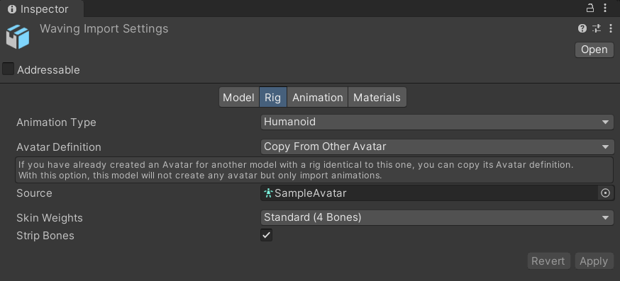
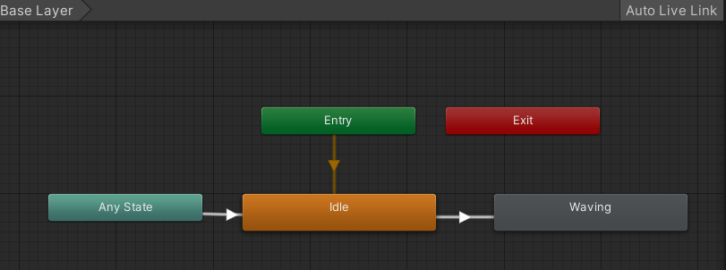
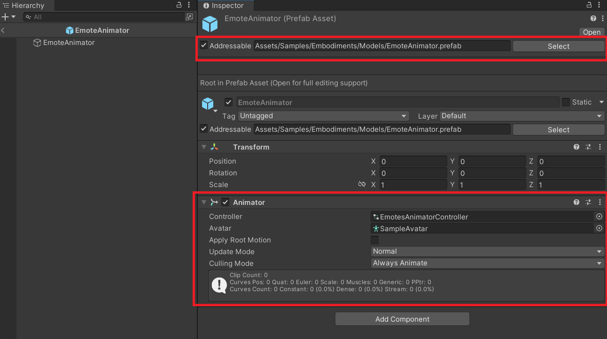
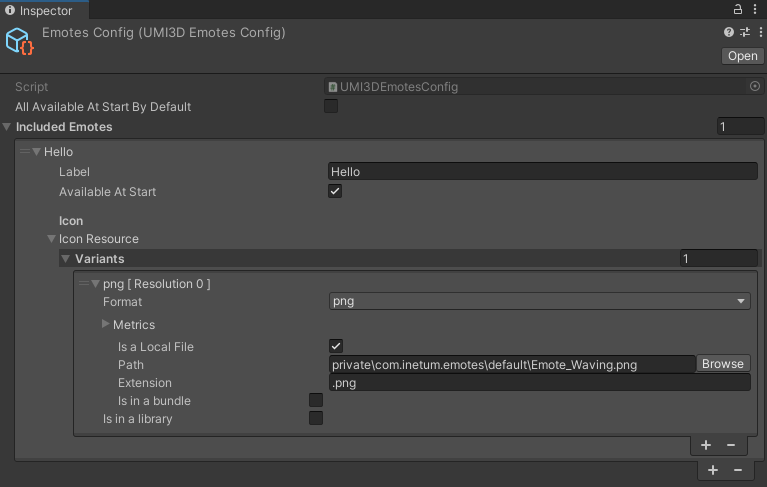

# Provide emotes to users

Emotes are short body animations that a end user can trigger using a specific UI in their own browser. They are often used to convey a specific social information.

## Create your emote animation bundle

!!! abstract "Requirements"
     To create an animation bundle, you'll need the Unity package Asset Bundle Browser (_com.unity.assetbundlebrowser_). Make sure to import it in your animation project beforehand.

### 1 - Rig the animated skeleton

First, you'll need a Unity avatar description to import your humanoid animations. It is best that this avatar corresponds to the one you will be using on users. You can create one and rig it from scratch or export it from an animation package.


!!! note "Hierarchy Definition"
    For the sake of simplicity, this guide assume that your animations are rigged in a way that the avatar humanoid description is closed to the UMI3D Standard Hierarchy Definition. It is possible to use other hierarchical configuration through the use of a _SkeletonMapper_.

Then import your animations as humanoid and copy the hierarchy from the Unity avatar description.



### 2 - Set up the AnimatorController

Then, create an empty Animator Controller asset. (In Project Tab, Right-click + Create/Animator Controller)

Create an Idle default state, and one state for each emote. Each emote state should have a transition from idle towards them. The configuration should look like that:



### 3 - Export the bundle

Next, create an empty prefab and add an Animator component on the only GameObject node available. There, reference your emote AnimatorController.

Don't forget to toggle the option "Addressable" so that the prefab could be exported as a bundle.



Click on the "Select" button right new to the assetbundle adress bar. Then export your bundle through the assetbundle window.

You'll get a bundle file _"%your-animator-name%.prefab.bundle"_ in the export folder. Put that file in the data folder of your UMI3D server.


## Set up emotes

### 1 - Add an EmotesConfig scriptable object

Create a UMI3DEmotesConfig scriptable object asset. (In Project Tab, Right-click + Create/UMI3D/Collaboration/Emotes Config)


### 2 - Set up the EmotesConfig

For each of your emotes, add a row in the _IncludedEmotes_ list. There, reference the label of the emote that will be displayed to user. Adding an icon is optional.

Make sure to toggle "Available at start" for the emote to be available for users directly at the start of the server.



## Manage emotes

### 1 - Create an emote manager

Create a new script **EmoteManager** with those fields:

```cs
public class EmoteManager : MonoBehaviour
{
    [SerializeField, Tooltip("If true, emotes are sent to users when joining the environment.")]
    private bool shouldSendEmotes = true;

    [SerializeField, Tooltip("Emotes configuration file.")]
    private UMI3DEmotesConfig emoteConfig;

    [SerializeField, Tooltip("Emote animations ressource bundle.")]
    private UMI3DResource emoteBundleResource;

    [SerializeField, Tooltip("Name of the state in the animations ressource bundle, in the order of emotes.")]
    private List<string> animatorStateNames = new();

    [SerializeField, Tooltip("Place where to store emote animations.")]
    private UMI3DNode emotesNodeRoot;
    
    // Store nodes that contains our emote animations.
    private readonly Dictionary<UMI3DUser, UMI3DSkeletonAnimationNode> emoteAnimationNodes = new();
}
```

And attach the associated component to one of the gameobject in your environment. Lastly, fill up the fields.


Make sure to order the state name in the order in which you have defined the emotes in the IncludedEmotes list of the UMI3DEmotesConfig file.

### 2 - Create skeleton animations

Add a new method to the **EmoteManager** class, that will define the required operations to generate the skeleton animation node correctly.

```cs
    private IEnumerable<Operation> CreateSkeletonAnimationNode(UMI3DCollaborationUser user)
    {
        GameObject subskeletonGo = new($"Emote animation subskeleton - user {user.Id()}");
        subskeletonGo.transform.SetParent(emotesNodeRoot.transform);
        subskeletonGo.transform.SetLocalPositionAndRotation(Vector3.zero, Quaternion.identity);

        // Create skeleton node for animations
        UMI3DSkeletonAnimationNode skeletonNode = subskeletonGo.AddComponent<UMI3DSkeletonAnimationNode>();

        // Create skeleton node as a UMI3D component
        skeletonNode.objectModel.SetValue(emoteBundleResource);
        skeletonNode.userId = user.Id();
        skeletonNode.priority = 100; // priority over 100 overrides other default skeleton animations and poses
        skeletonNode.animationStates = animatorStateNames.Take(emoteConfig.IncludedEmotes.Count).ToList(); // Only take the animator states names up till what has been defined in the emoteConfig

        // Create animations
        List<Operation> ops = new();
        ops.AddRange(skeletonNode.GenerateAnimations(arePlaying: false)); // create an UMI3D Animation for each state i.e. emote
        ops.Add(skeletonNode.GetLoadEntity());
        emoteAnimationNodes[user] = skeletonNode;

        return ops;
    }
```

### 3 - Bind animations and emotes

Add another new method to the **EmoteManager** class, that will define the required operations for users to be able to trigger emote through the emote pipeline.

```cs
    private IEnumerable<Operation> SetupEmotes(UMI3DCollaborationUser user)
    {
        List<Operation> ops = new();

        var skeletonNode = emoteAnimationNodes[user];

        int indexAnim = 0;
        foreach (var emote in emoteConfig.IncludedEmotes)
        {
            // get the animations created in CreateSkeletonAnimationNode()
            UMI3DAbstractAnimation animation = UMI3DEnvironment.Instance._GetEntityInstance<UMI3DAbstractAnimation>(skeletonNode.relatedAnimationIds[indexAnim++]);

            // If no label is defined, emote label is the animation label
            if (string.IsNullOrEmpty(emote.label) && animation is UMI3DAnimatorAnimation animatorAnimation)
                emote.label = animatorAnimation.objectStateName.GetValue();

            emote.AnimationId.SetValue(user, animation.Id());
            emote.Available.SetValue(user, emoteConfig.allAvailableAtStartByDefault || emote.availableAtStart);

            ops.Add(animation.GetLoadEntity()); // load animation associated with skeleton animation, for all users
        }
        // only the new user receive a copy of its emote config
        ops.Add(emoteConfig.GetLoadEntity(new() { user }));

        return ops;
    }

```

### 4 - Load emotes on join

Regroup the two setup steps in a common method, and do not forget to register the emote config for the user in the UMI3DEmoteDispatcher.
Send the operations within a transaction to load emotes.

```cs
    public IEnumerable<Operation> LoadEmotes(UMI3DCollaborationUser user)
    {
        if (!shouldSendEmotes)
            return new List<Operation>();

        // Associate animation with emotes
        EmoteDispatcher.Instance.EmotesConfigs.Add(user.Id(), emoteConfig);

        List<Operation> ops = new();
        ops.AddRange(CreateSkeletonAnimationNode(user));
        ops.AddRange(SetupEmotes(user));

        return ops;
    }
```

Remember to clean emotes when the user is leaving. Send the operations returned by this method in order to do so.

```cs
    public IEnumerable<Operation> CleanEmotes(UMI3DUser user)
    {
        List<Operation> ops = new ();
        if (!shouldSendEmotes)
            return ops;

        ops.AddRange(emoteAnimationNodes[user].GetDeleteAnimations());
        ops.Add(emoteAnimationNodes[user].GetDeleteEntity());
        UnityEngine.Object.Destroy(emoteAnimationNodes[user].gameObject);

        emoteAnimationNodes.Remove(user);

        return ops;
    }
```

Send the operation through a transaction when a user join/leave the environment.

```cs
    private IUMI3DServer UMI3DServerService;

    private void Start()
    {
        UMI3DServerService = UMI3DServer.Instance;

        UMI3DServerService.OnUserJoin.AddListener((user) =>
        {
            Transaction t = new(true);
            t.AddIfNotNull(LoadEmotes(user as UMI3DCollaborationUser));
            t.Dispatch();
        });

        UMI3DServerService.OnUserLeave.AddListener((user) =>
        {
            Transaction t = new(true);
            t.AddIfNotNull(CleanEmotes(user as UMI3DCollaborationUser));
            t.Dispatch();
        });
    }
```

!!! question "Cannot see your emotes playing?"
    Remember that you won't be able to see the emotes playing if you have not bound an avatar model to the user's skeleton, because only the skeleton is animated and it is not visible. In order see it moving, refer to the guide [How to bind an avatar model to a user ?](add-an-avatar-to-a-user.md).
