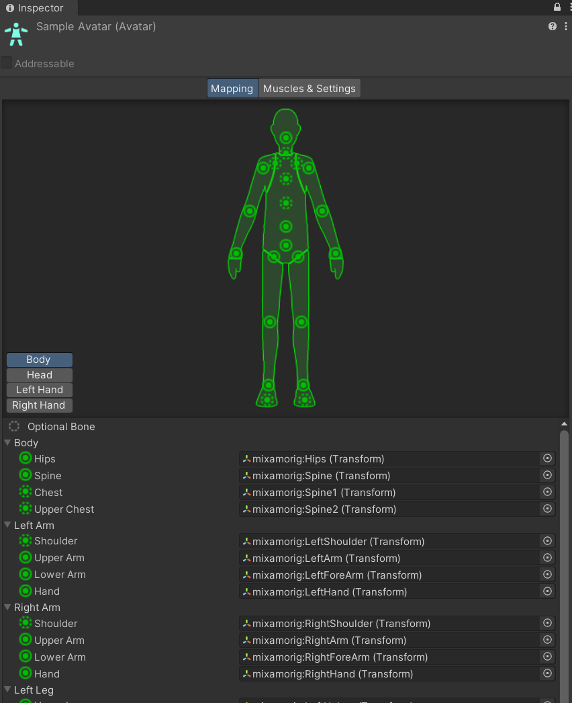
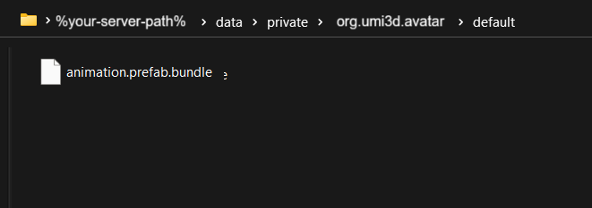

# Animate a user avatar on movement

## Create your movement animations bundle

!!! abstract "Requirements"
     To create an animation bundle, you'll need the Unity package Asset Bundle Browser (_com.unity.assetbundlebrowser_). Make sure to import it in your animation project beforehand.

### 1 - Rig the animated skeleton

First, you'll need a Unity avatar description to import your humanoid animations. It is best that this avatar corresponds to the one you will be using on users. You can create one and rig it from scratch or export it from an animation package.



!!! note "Hierarchy Definition"
    For the sake of simplicity, this guide assume that your animations are rigged in a way that the avatar humanoid description is closed to the UMI3D Standard Hierarchy Definition. It is possible to use other hierarchical configuration through the use of a _SkeletonMapper_.

### 2 - Set up the movement AnimatorController

Then, create an empty Animator Controller asset. (In Project Tab, Right-click + Create/Animator Controller)

Add a blendtree (In Animator Tab, Right-click + Create State / From new blendtree) and define it as default state. (In Animator Tab, Right-click on the blend tree + Set as layer default state)

The animator controller should look like this:


Then, open the blendtree and create a animation for each of the movement animation you want to blend. Then create parameters for the parameters you want to track. Here, SPEED_X_Z will be the value of the user's speed on the (X,Z) plane.


### 3 - Export the bundle

Next, create an empty prefab and add an Animator component on the only GameObject node available. There, reference your emote AnimatorController.

Don't forget to toggle the option "Addressable" so that the prefab could be exported as a bundle.


Click on the "Select" button right new to the assetbundle adress bar. Then export your bundle through the assetbundle window.

You'll get a bundle file _"%your-animator-name%.prefab.bundle"_ in the export folder. Put that file in the data folder of your UMI3D server.



## Manage the user's movements animations

### 1 - Create an animation dispatcher

Create a new script **WalkingAnimationsDispatcher** with those fields:

```cs
public class WalkingAnimationsDispatcher : MonoBehaviour
{
    [Header("Movement animation")]
    [SerializeField, Tooltip("If true, user's avatar will be animated on movement.")]
    private bool shouldSendWalkingAnimator;

    [SerializeField, Tooltip("Resource for the animation bundle.")]
    public UMI3DResource animatedSubskeletonBundleResource;

    [SerializeField, Tooltip("Name of the state in the animations ressource bundle, in the order of emotes.")]
    private List<string> animatorStateNames = new();

    [SerializeField, Tooltip("Place where to store skeleton animations.")]
    private UMI3DNode animationsRootNode;

    private readonly Dictionary<UMI3DUser, UMI3DSkeletonAnimationNode> skeletonAnimationNodes = new();
}
```

### 2 - Send the skeleton animations

Regroup the two setup steps in a common method..
Send the operations within a transaction to load movement animation.
The parameter will be automatically updated by the browser based on the user's movements.

```cs
    private IEnumerable<Operation> LoadWalkingAnimations(UMI3DCollaborationUser user)
    {
        List<Operation> ops = new();

        // Create skeleton node for animations
        GameObject subskeletonNodeGo = new("Movement animation subskeleton");
        subskeletonNodeGo.transform.SetParent(animationsRootNode.transform);
        subskeletonNodeGo.transform.SetLocalPositionAndRotation(Vector3.zero, Quaternion.identity);

        UMI3DSkeletonAnimationNode skeletonNode = subskeletonNodeGo.AddComponent<UMI3DSkeletonAnimationNode>();
        skeletonAnimationNodes.Add(user, skeletonNode);
        skeletonNode.objectModel.SetValue(animatedSubskeletonBundleResource);
        skeletonNode.userId = user.Id();
        skeletonNode.priority = -10;
        skeletonNode.animationStates = animatorStateNames;
        skeletonNode.animatorSelfTrackedParameters = new SkeletonAnimationParameter[] {
            new()
            {
                parameterName = SkeletonAnimatorParameterKeys.SPEED_X_Z.ToString(),
                parameterKey = (uint)SkeletonAnimatorParameterKeys.SPEED_X_Z,
                ranges = new()
            }
        };

        // Create Animator animations
        ops.AddRange(skeletonNode.GenerateAnimations(areLooping: true));
        ops.Add(skeletonNode.GetLoadEntity());

        return ops;
    }
```

Remember to clean animations when the user is leaving.Define the operation to clean the UMI3D entities.

```cs
    public IEnumerable<Operation> Clean(UMI3DCollaborationUser user)
    {
        List<Operation> ops = new();

        // walking animation
        ops.AddRange(skeletonAnimationNodes[user].GetDeleteAnimations());
        ops.Add(skeletonAnimationNodes[user].GetDeleteEntity());
        UnityEngine.Object.Destroy(skeletonAnimationNodes[user].gameObject);

        return ops;
    }
```

### 3 - Send animations on join

Send the operation through a transaction when a user join/leave the environment.

```cs
    private IUMI3DServer UMI3DServerService;

    private void Start()
    {
        UMI3DServerService = UMI3DServer.Instance;

        UMI3DServerService.OnUserJoin.AddListener((user) => Handle(user as UMI3DCollaborationUser));
        UMI3DServerService.OnUserLeave.AddListener((user) => Unhandle(user as UMI3DCollaborationUser));
    }

    private void Handle(UMI3DCollaborationUser user)
    {
        if (!shouldSendWalkingAnimator)
            return;

        Transaction t = new(true);
        foreach (var (_, skeletonNode) in skeletonAnimationNodes.Where(x => x.Key != user))
        {
            t.AddIfNotNull(skeletonNode.GetLoadAnimations(user));
        }
        t.AddIfNotNull(LoadWalkingAnimations(user));
        t.Dispatch();
    }

    private void Unhandle(UMI3DCollaborationUser user)
    {
        if (!shouldSendWalkingAnimator)
            return;
        Transaction t = new(true);
        t.AddIfNotNull(Clean(user ));
        t.Dispatch();
    }
```

!!! question "Cannot see your animations playing?"
    Remember that you won't be able to see the movement animations playing if you have not bound an avatar model to the user's skeleton, because only the skeleton is animated and it is not visible. In order see it moving, refer to the guide [How to bind an avatar model to a user ?](add-an-avatar-to-a-user.md).
