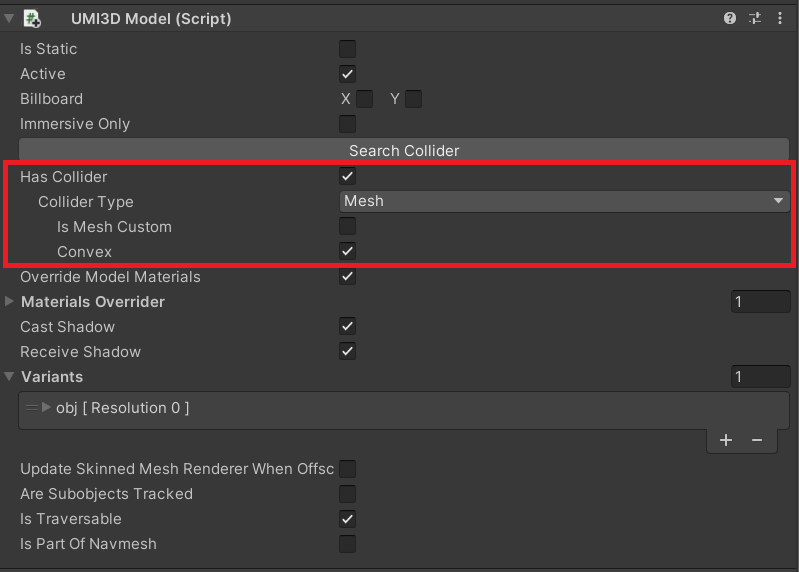

# Create a button

Add interactivity to your environment by using the interaction system to make a simple button.

## Set up an interactable object

### 1. Add a collider

Take that object you want to be interactable on trigger when the user points towards it. It should be an object with a UMI3DModel component on it. Enable the property "has a collider".



### 2. Make the object interactable

Add an UMI3DInteractable component to the object.


## Add the trigger interaction

### 1. Create the event

Add a UMI3DEvent component to the object.


And reference it in the interactions list of the UMI3DInteractable component.


### 2. Define custom behaviour

Add a new script to the object and write down the code to execute when a user triggers the button. Here is an example.

```cs
using umi3d.edk;

using UnityEngine;

using static umi3d.edk.interaction.AbstractInteraction;

public class ButtonAction : MonoBehaviour
{
    private UMI3DModel buttonModel;

    private void Start()
    {
        buttonModel = GetComponent<UMI3DModel>();
    }

    public void Press(InteractionEventContent content)
    {
        buttonModel.transform.Translate(-0.01f * Vector3.up);

        Transaction t = new();
        t.AddIfNotNull(buttonModel.objectPosition.SetValue(content.user, buttonModel.transform.localPosition)); // content.user is the user that triggered the button
        t.Dispatch();
    }
}
```

The _Press_ method will be the method executed when an interaction with the button occurs. Context information is available in the event content parameter.

Configure the method to be triggered when a user click on the button in the Unity Inspector.


